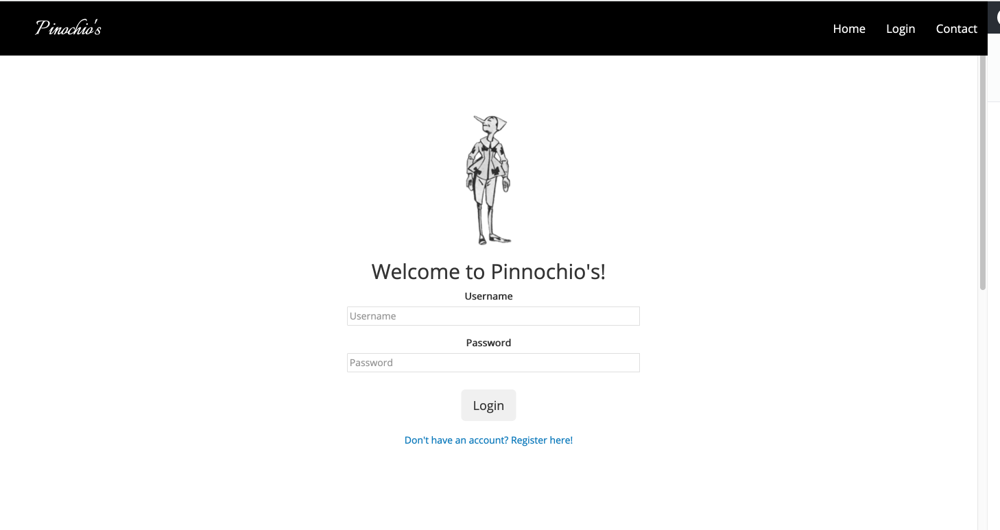
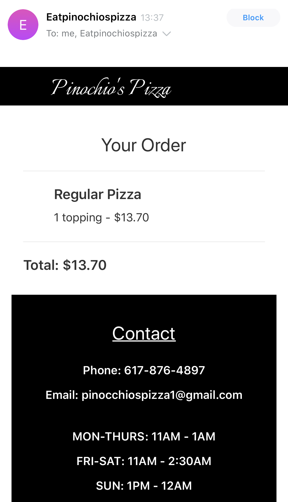

# Pinochio's Pizza

Pinochio's Pizza is a pizza ordering application based on the restaurant of the same name in Cambridge, Massachusetts (http://www.pinocchiospizza.net/). Once registered and logged in, the application allows users to browse Pinochio's Pizza's menu, add items to their cart and submit their order. All user accounts, menu items, user orders and items in users cart are stored in a Postgresql database. The contents of the order page and orders are dynamically generated by querying the database. Once an order is submitted, a confirmation email is sent to the user's email.

This application was built using Python and Django using Web Sockets with a HTML/CSS frontend.

# View the app on Heroku
https://eatpinochiospizza.herokuapp.com

# Screenshots

The below screenshot shows the Pinochio's Pizza homepage.

In order to make an order, the user must login via the login page shown below.

Once a user is logged in, they can navigate to the "Order" page, which allows them to browse the various menu categories and add items to their cart. The items on the "Order" page are dynamically generated by querying the database.

A confirmation alert is displayed when an item is successfully added to the user's cart.

In order to add toppings to a pizza, the user must have a pizza in their cart with toppings included. If they have reached the limit of allowed toppings, they are unable to add additional toppings until they remove a topping or add a new pizza. The same applies to extras for subs.

Once a user has added their items to their cart, they can navigate to the "Cart" page, which shows all of the user's items and their order total.

Once an order is submitted, the user is presented with a confirmation page and a receipt.

The user will also recieve a confirmation email for their order, based on the email they provided at the time of registration.

